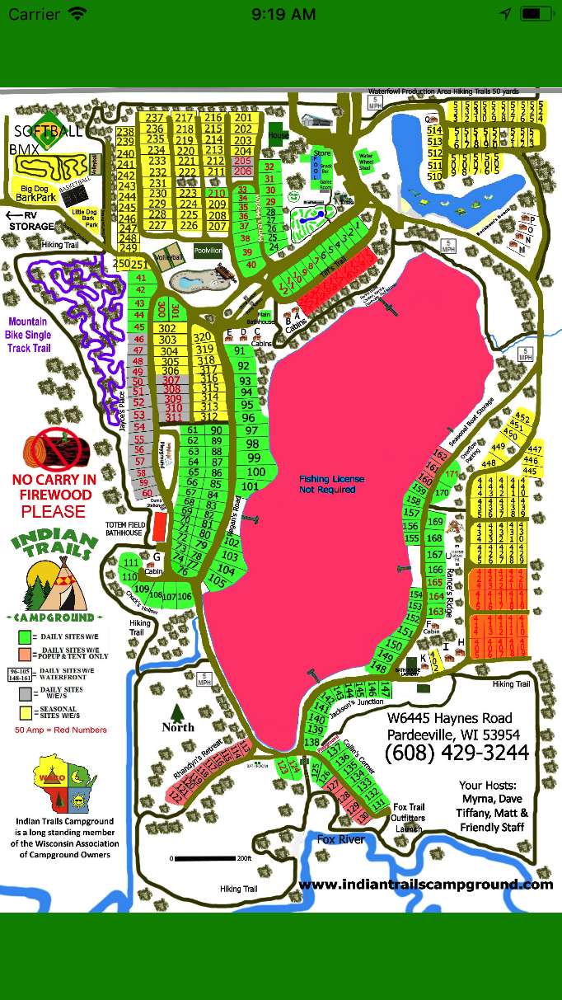
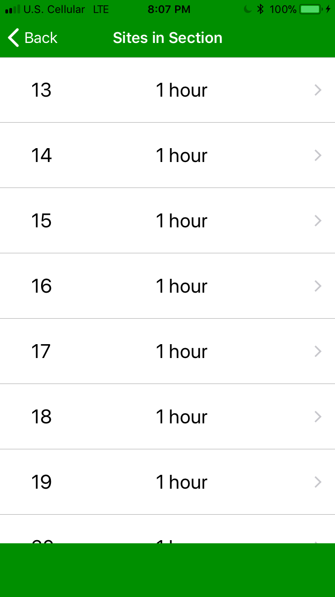
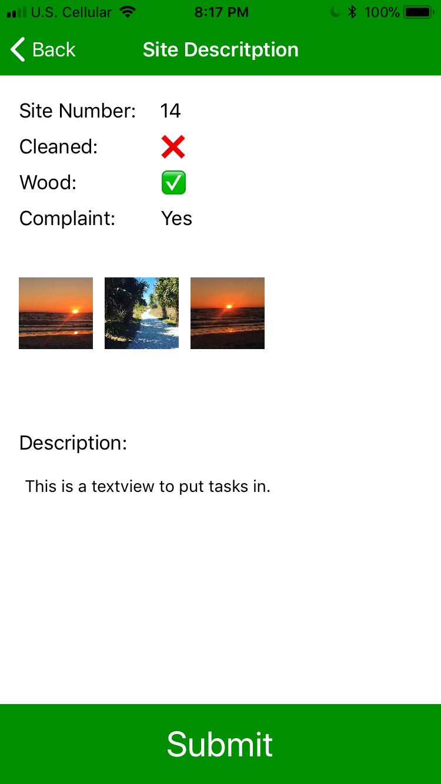
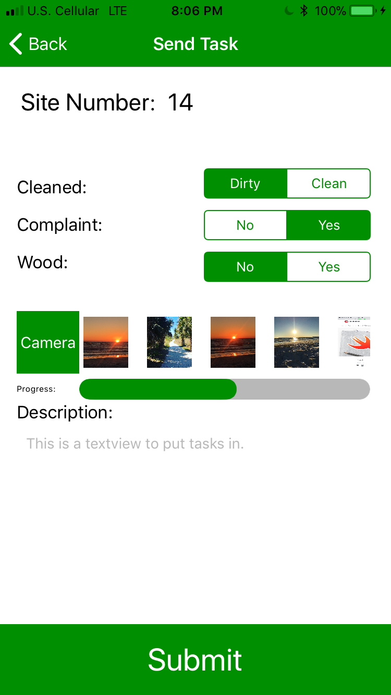
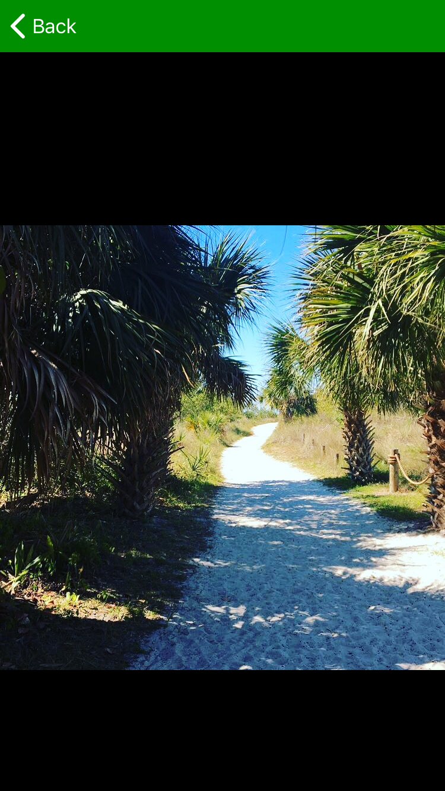

# CampgroundManager
This application is the project for my independent study. 

The application will be used to manage the grounds of a campground. Campground Manager will allow employees
to see individually tasks that must be completed and for managers to delegate tasks. The app uses an image of the campground
with SVG layers ontop of it to show which sections of the campground have tasks associated with them. 

I wanted to create this application because throughout the five summers I had worked at Indian Trails Campground 
there was constant miscommunication between employees. This app would allow better communication, and save 
wasted time trying to find the next task to do outside. I am not only excited to create this because I am very interested in 
iOS development but I will also be solving a real problem with an application that I have made.

I also have received an Innovation Grant for reaching out to a professor and trying to create an original application
to solve a problem that I had identified. 

What is in Progress?
--------------------------------------------------------------------------------------------------
(March23/24) As of Friday night into Saturday morning I have added a feature for manager roles to
add images to the task they will assign. This will allow for the manager to further clarify a task
with an image or diagram.

I am currently going to work on storing the images in Firebase Storage and present them to the an employee role if they open up a site that contains an image.

(March 26) Functionality for both employee and managers to pull or push images. Major improvements on UI to still be made

(Friday, March 30) Uploading images for employees to view is possible, managers can also view images that they select, keyboard and navbar bug fixed, zoomscale fixed

--------------------------------------------------------------------------------------------------

University:     UW - La Crosse
Official Class: CS-395
Professor:      Dr. Senger

<h1>Current UI for Users</h1> 
<h3>Interactive Map</h3>
 
<h3>Sign In View</h3>
 
<h3>Choosing which site to view</h3>

<h3>Employee and Manager UI</h3>

 
<h3>Employee and Manager UI</h3>

